# 
HA2 Report

### 
Neural Networks for Recognition

-   ID: 20789743

-   Name: Bingnan CHEN

### Q1.1

$softmax(x+c)=\frac{e^{x_i+c}}{\sum_j e^{x_j+c}}=\frac{e^{x_i}*e^c}{\sum_j e^{x_j}*e^c}=softmax(x)$

In this way, it could rearrange the input range to negative section, which leads the results to range $(0, 1)$, getting relatively smaller results.

### Q1.2

-   each element range: $(0, 1]$, sum over all elements: $1$
-   probability distribution
-   step1: map input to range $(0, +\infin)$ usign exponential function; step2: sum all mapped inputs' results; step3: calculate the probality of each element.

### Q1.3

Using multi-layer neural networks without a non-linear activation function:
$Y=W_4(W_3(W_2(W_1X+b_1)+b_2)+b_3)+b_4=WX+b$
$\therefore$ It's equivalent to linear regression.

### Q1.4

$\sigma'(x)=\frac{e^{-x}}{(1+e^{-x})^2}=\sigma(x)-\sigma^2(x)$

### Q1.5

$y=W^Tx$
$\therefore \frac{\partial J}{\partial W}=x(\frac{\partial J}{\partial{y}})^T=x\delta^T$
$\frac{\partial J}{\partial x}=W\frac{\partial J}{\partial y}=W\delta$
$\frac{\partial J}{\partial b}=\frac{\partial J}{\partial y}=\delta$

### Q1.6

1. sigmoid function squish a large input space into a small input space between 0 and 1. Therefore a large change in the input of the sigmoid function will cause a small change in the output. So the derivative becomes small.
2. tanh output range: $(-1, 1)$; sigmoid output range: $(0, 1)$; The reason we might prefer tanh is:
    1. tanh is a wide variety of sigmoid functions, it has wider range.
    2. tanh is symmetric about the origin, where the inputs would normalized and they are more likely to produce outputs and also they are on an average close to 0. And sigmoid is asymmeatric which might lead systematic bias.
    3. The gradient of tanh i slarger(shown below), which makes the model easier to train.
3. derivative of sigmoid:
   ;
   derivative of tanh:
   
   It's clearly that tanh(x)'s gradient is relatively larger. (Shown by the range of y-axis.)
4. $tanh(x)=\frac{e^x-e^{-x}}{e^x+e^{-x}}=1-\frac{2}{e^{2x}+1}=1-2\sigma(-2x)=2\sigma(2x)-1$

### Q2.1.1

1. Neural networks tend to get stuck in local minima, so it's a good idea to give them many different starting values. You can't do that if they all start at zero.
2. If the neurons start with the same weighs, then all the neurons will follow the same gradient, and will always end up doing the same thing as one another.

### Q2.1.3

-   Initialize with random numbers: Increase the chance to reach to the optimal parameters that can lead to low loss, which is helpful to find the optimal weights about the model. And it also satisfies the requirements of stochastic gradient descent method, which is helpful to break the symmetry and makes it learn faster.
-   Using scale: To make the ratio of activation varianve largger to avoid vanish or explode about the gradient in back-propagation process especially because of the multiplicative effective through layers. To make the variance of back-propagated gradient to be dependent on the layer.

### Q3.1.1

-   Validation accuracy: 0.76861

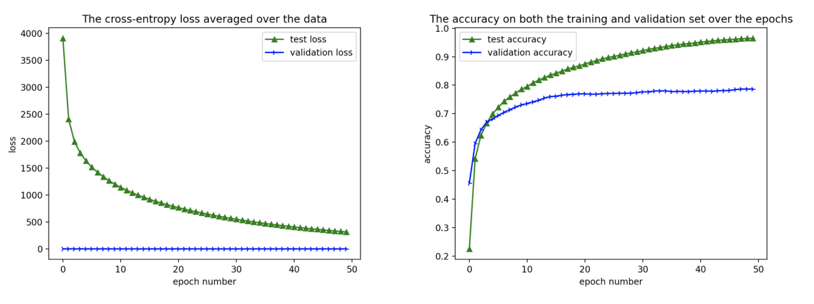

### Q3.1.2

From the images, we could see that with proper learning rate, the model could converge to local minimum quickly with low loss and high accuracy. If we set higher learning rate, the curve will have more fluctuations and become hard to find the local minimum. If we set lower learning rate, the model will also converge to local minimum, but the final accuracy is lower compared to the best learning rate.

-   with best learning rate: 0.01

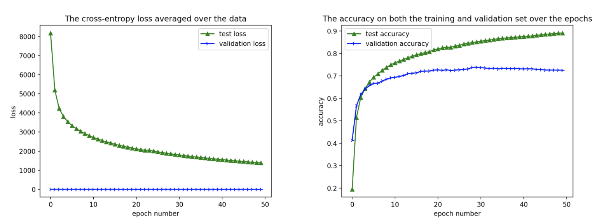

-   left: 10 times the best learning rate, 0.1
-   right: tenth the best learning rate, 0.001

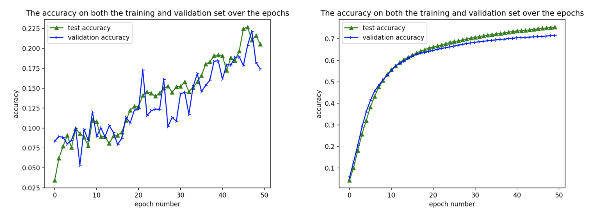

-   best accuracy (validation dataset, test dataset): (0.7717,0.775)

### Q3.1.3

From the learned weights, we could distinguish some patterns or edges. The original weights are random distributed with no specific signal.

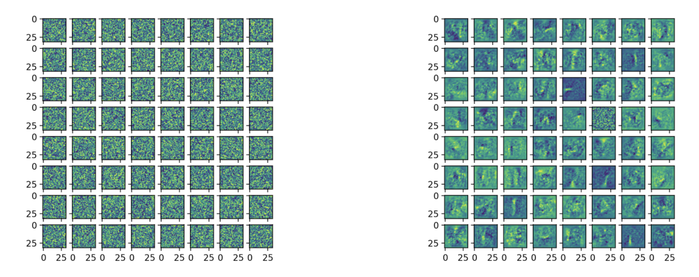

### Q3.1.4

Most commonly confused: {O, 0}, {5, S}. They look like similar, hard to distinguish especially in hand-written letters.

### Q4.1

1. All pixals shoule be a part of the character or background, which means there should be no space in the character.
2. Character should be proper size and could be resized to $32 \times 32$

-   Examples expected to fail: - letter $c$ has relatively small size - letters $A,B,D$ have seperated parts

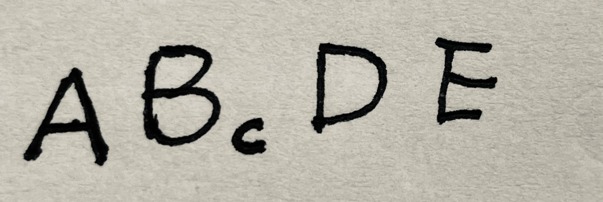
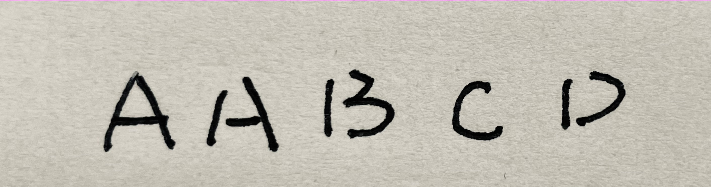

### Q4.3

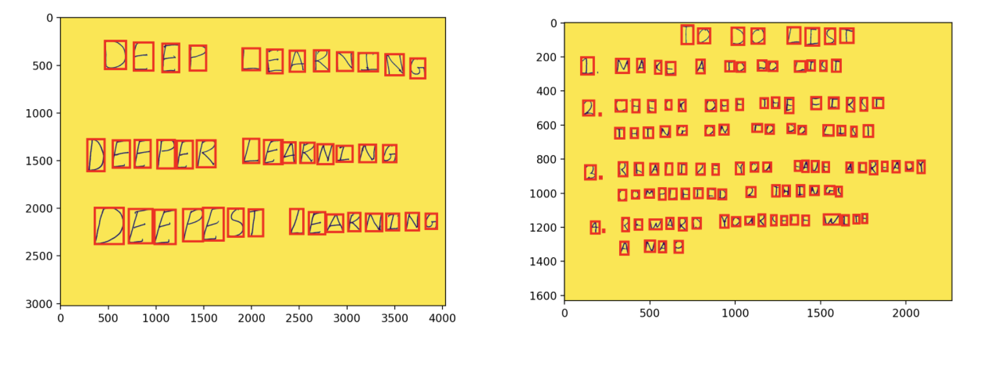

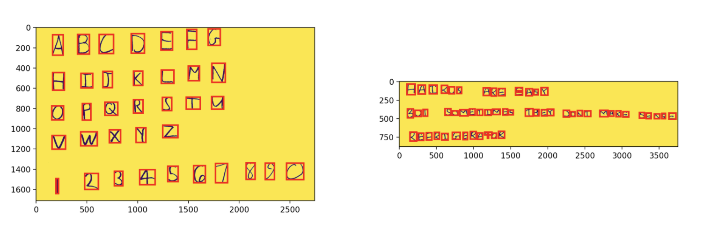

### Q4.4

-   Fig1 Accuracy: $\frac{6+13+12+15+11+10+4}{8+14+17+15+22+16+19+4}=\frac{71}{101}=70.3\%$

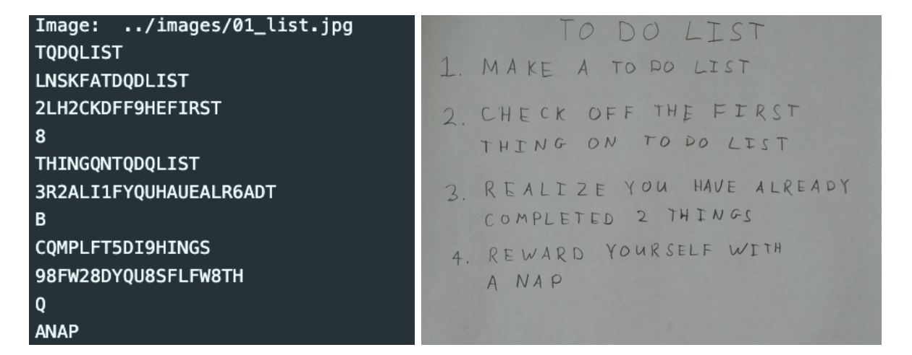

-   Fig2 Accuracy: $\frac{22}{26+10}=61.1\%$

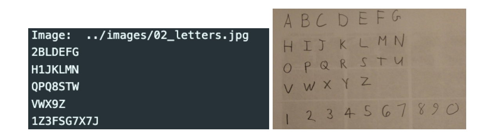

-   Fig3 Accuracy: $\frac{9+18+6}{13+29+12}=61.1\%$

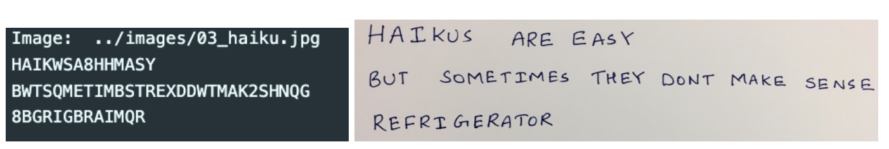

-   Fig4 Accuracy: $\frac{6+7+10}{36}=63.89\%$

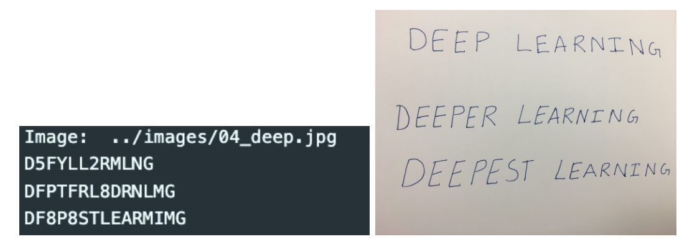

### Q5.2

The loss drops drastically at the beginning, and the gradient decrease at the tail part. And this curve converges finally.

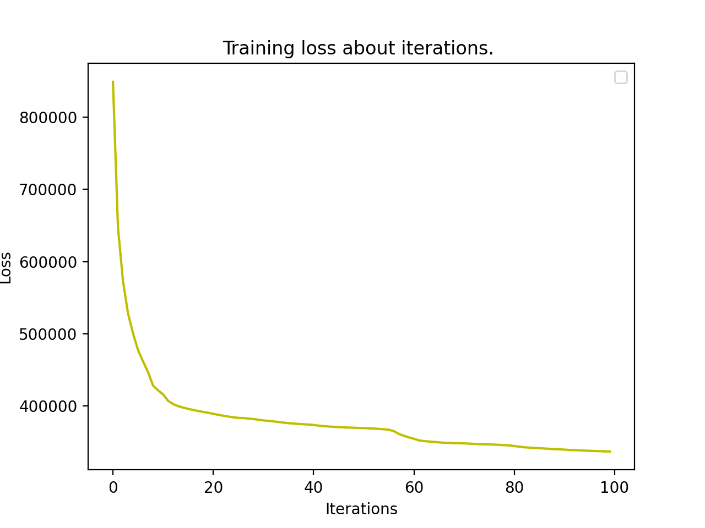

### Q5.3.1

-   The output images are blurred and having light color compared to the original images. There are also some noises around the images.

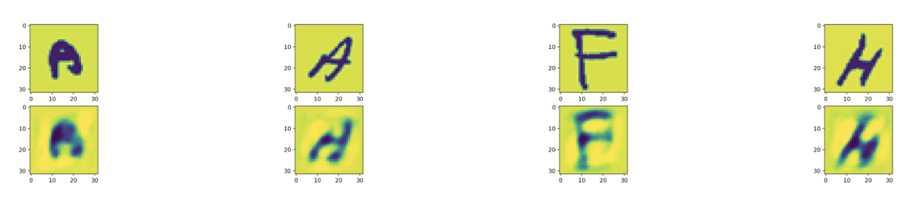

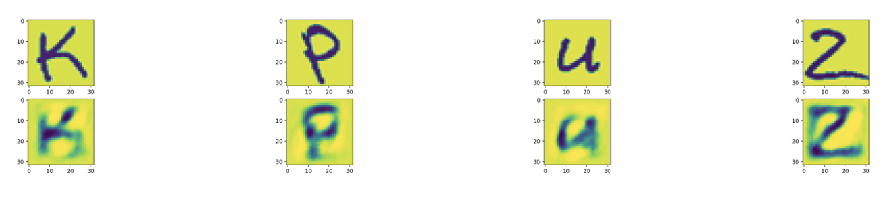

### Q5.3.2

Validation images PSNR value: 15.459162791013066

### Q6.1

-   size: (32, 1024)
-   rank: 32

### Q6.2

The color is lighter compared to the autoencoder's output. And also pca's output has more nioses about the boundaries, so the outputs are harder to identify.

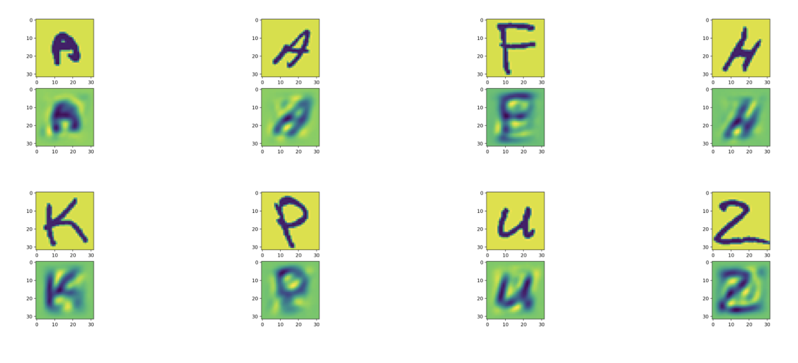

### Q6.3

Validation images PSNR value: 16.348422786979377.

It's better than autoencoder. PSNR is an approximation to human perception of reconstruction quality, although a higher PSNR generally indicates that the reconstruction is of higher quality, there exists some exceptions. PSNR is calculated for the whole image, so the visual impact may deceive us.

### Q6.4

-   Autoencoder: $1024\times 32 + 32\times 32 + 32\times 32 + 32 \times 1024=68704$
-   PCA: $32 \times 1024=32768$

Seen from the number of parameters, autoencoder gets more information to learn. And autoencoder combines with linear and nonlinear transformation, which could extracts more features.

### Q7.1.1

-   train accuracy & train loss

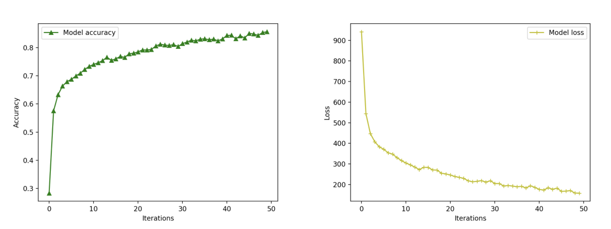

### Q7.1.2

-   train accuracy & train loss

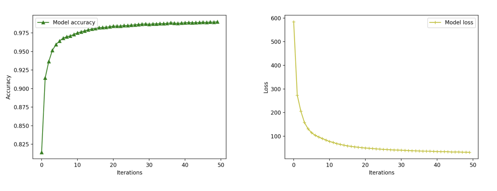

### Q7.1.3

-   train accuracy & train loss

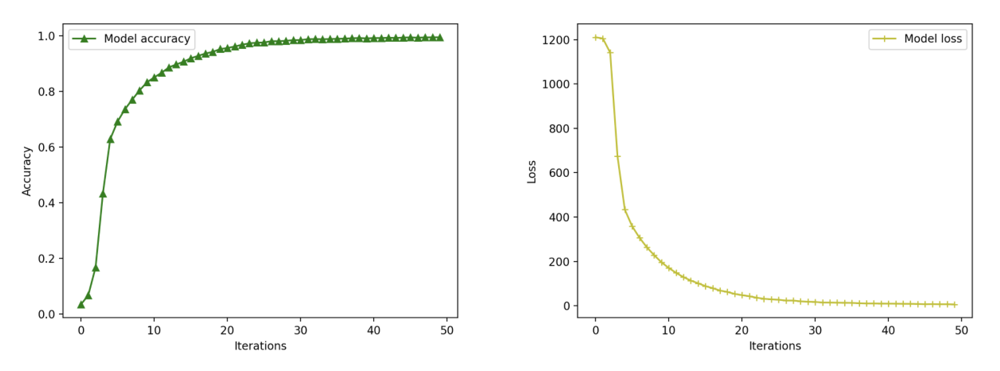

### Q7.1.4

-   Train accuracy & Train loss

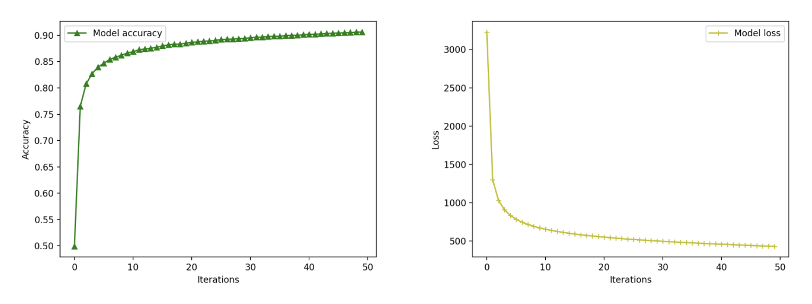

-   Recognition Accuracy

-   Fig1 Accuracy: $\frac{7+11+15+9+16+11+14+4}{101}=86.14\%$

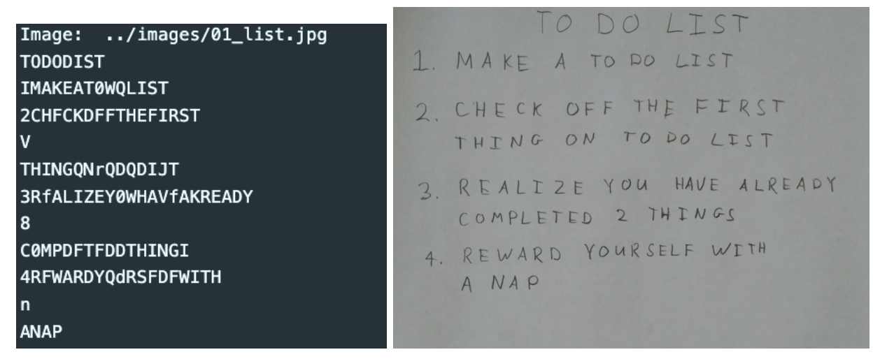

-   Fig2 Accuracy: $\frac{27}{26+10}=75\%$

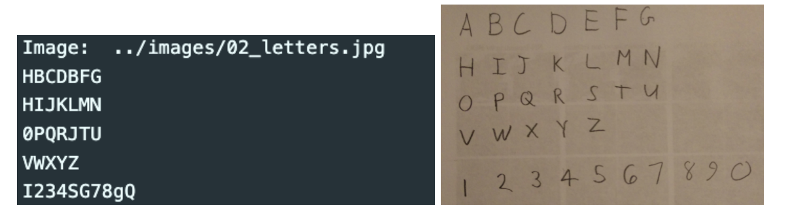

-   Fig3 Accuracy: $\frac{10+21+9}{13+29+12}=74.07\%$

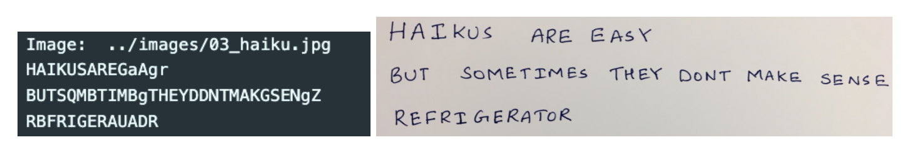

-   Fig4 Accuracy: $\frac{8+11+10}{36}=80.56\%$

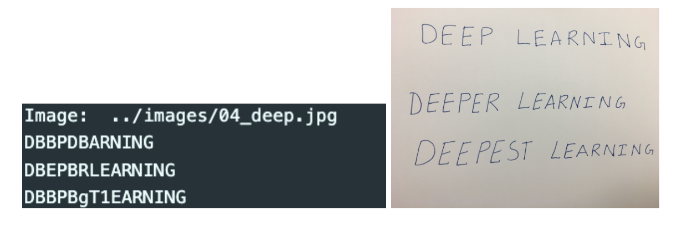

### Q7.2

From the figures, we find the fint-tune model gets better accuracy with less epochs and less fluctuations. Plus, fine-tune model outcomes better loss with less epochs compared with scratch model.

#### Fine-tune Model

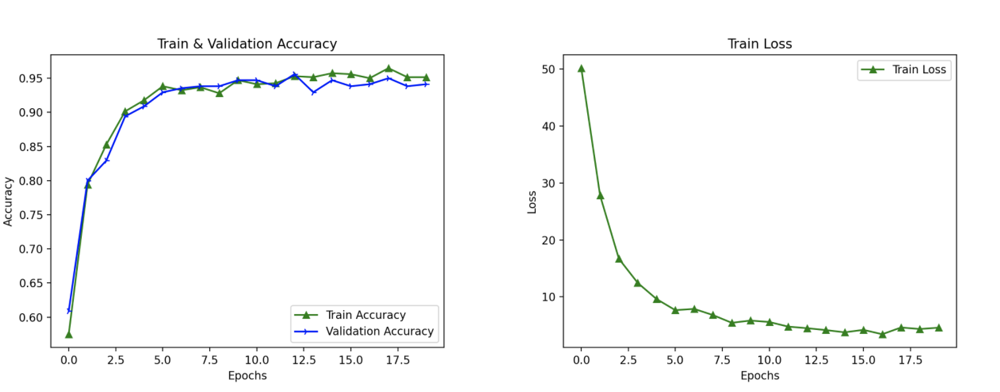

-   Test Accuracy: 0.9941

#### Scratch Model

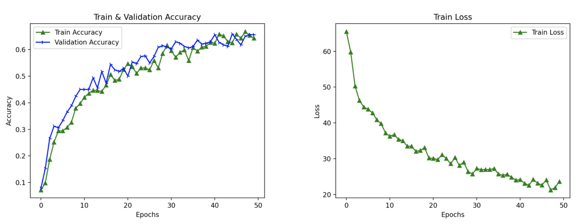

-   Test Accuracy: 0.8721
