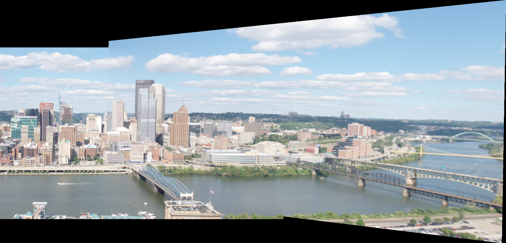
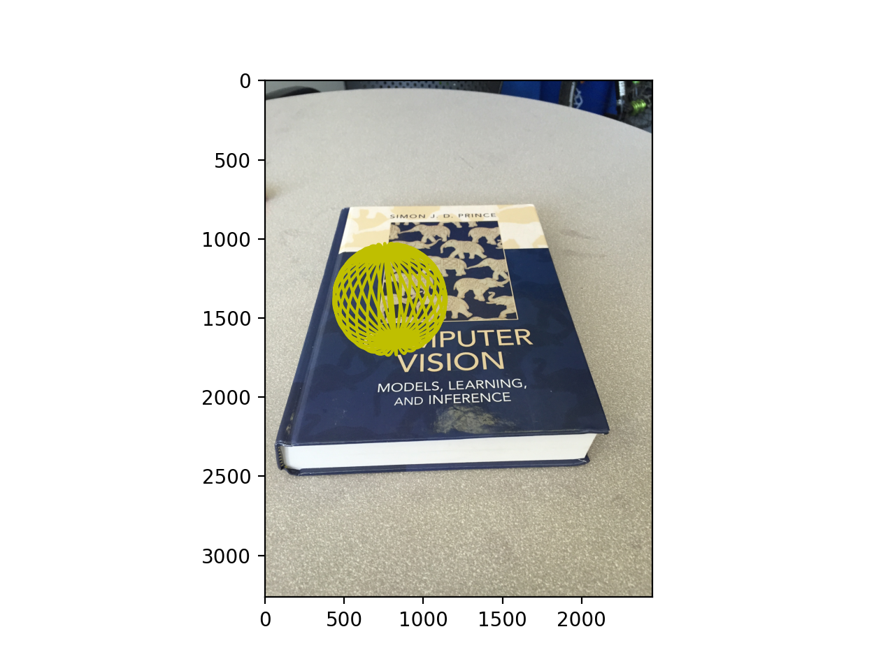
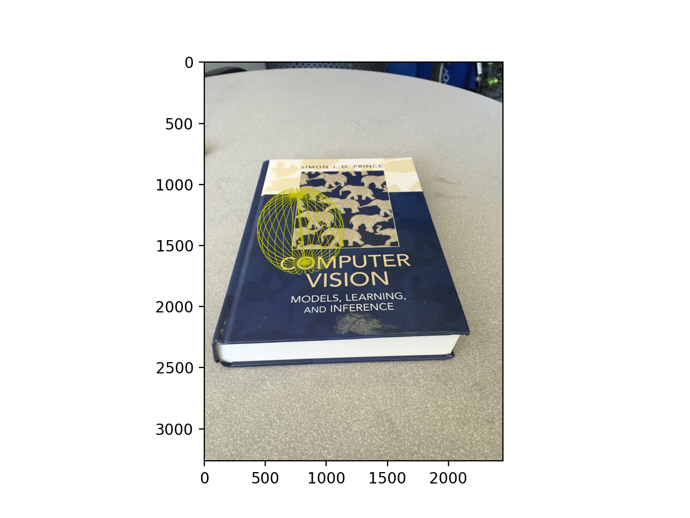

# <center>HA3 Report</center>

### <center>Homographies & RANSAC & Image Stitching</center>

- ID: 20789743

- Name: Bingnan CHEN

### Q1.1

#### (a)

$\lambda_n \tilde{x_n}=H\tilde{u_n}$

$\therefore x_i=\frac{h_{11}u_i+h_{12}v_i+h_{13}}{h_{31}u_i+h_{32}v_i+h_{33}}$

$\therefore y_i=\frac{h_{21}u_i+h_{22}v_i+h_{23}}{h_{31}u_i+h_{32}v_i+h_{33}}$

```math
0 = Ah = \left[
 \begin{matrix}
   u_1 & v_1 & 1 & 0 & 0 & 0 & -x_1u_1 & -x_1v_1 & -x_1\\
   0 & 0 & 0 & -u_1 & -v_1 & -1 & y_1u_1 & y_1v_1 & y_1\\
   . & . & . & . & . & . & . & . & .\\
   u_N & v_N & 1 & 0 & 0 & 0 & -x_Nu_N & -x_Nv_N & -x_N\\
   0 & 0 & 0 & -u_N & -v_N & -1 & y_Nu_N & y_Nv_N & y_N
  \end{matrix}
  \right] \left[
 \begin{matrix}
   h_{11} \\
   h_{12} \\
   h_{13} \\
   h_{21} \\
   h_{22} \\
   h_{23} \\
   h_{31} \\
   h_{32} \\
   h_{33}
  \end{matrix}
  \right]
```

#### (b)

9 elements

#### (c)

4 points pairs

#### (d)

- First we apply SVD decomposition
- So we get $A=USV^T$
- $\therefore ||USV^Th||^2=||SV^Th||^2$
- Assume $p = V^Th$, so we need to minimize $||Sp||$ with contraints $||p||=1$
- $\therefore$ we let $p=[0, 0, ..., 1]^T$, in this way, we could minimize $||Sp||$
- $\therefore h=Vp$ is the last collumn of $V$

### Q4.1

- The result of warpped image `incline_R.jpg` according to the homography contained by `RANSAC`
  

### Q4.2

- The panorama image after stiching


- The panorama image after stiching without clipping



### Q5.2

- Use matplotlib function to draw the placement of the ball in the middle of the "o" in "Computer" using yellow color.
- Normal linewidth
  
- Use linewidth=0.4
  
